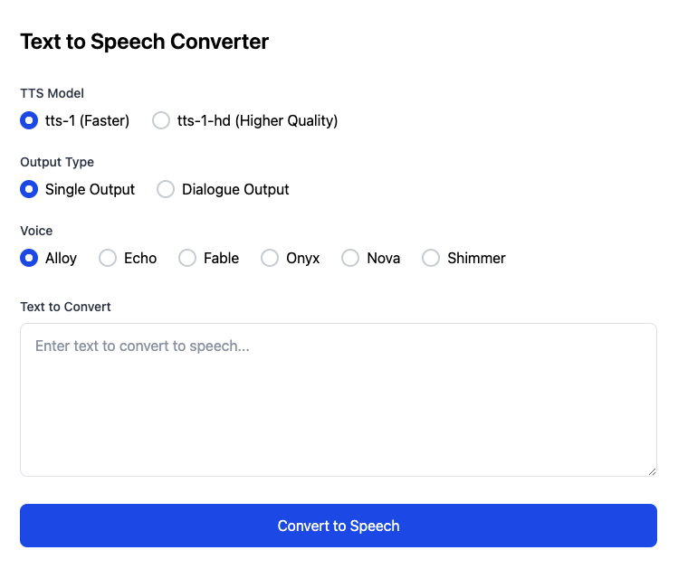

# English Practice Text-to-Speech Tool

A powerful web application that transforms text into natural-sounding speech using OpenAI's TTS API. Perfect for English learners who want to improve their listening and speaking skills through authentic audio practice.

## Preview



## Why Use This Tool?

This tool is your perfect companion for English practice, offering:
- Natural pronunciation of any text you write
- Multiple voice options for diverse listening experience
- Special dialogue mode for conversation practice
- Easy saving of audio files for repeated practice
- Perfect for self-study and exam preparation (IELTS, TOEFL, etc.)

## Key Features

- **Dialogue Mode**: Convert conversations with different voices for each speaker
- **Multiple Voice Options**: Choose from six distinct voices (Alloy, Echo, Fable, Onyx, Nova, Shimmer)
- **Quality Settings**: Select between standard (faster) or HD (higher quality) conversion
- **Easy-to-Use Interface**: Clean design focused on learning
- **Audio Controls**: Pause, replay, and adjust playback speed
- **Save Function**: Download audio files for offline practice

## Setup

1. Clone the repository

2. Install system requirements:
- For Windows: Download and install ffmpeg from https://ffmpeg.org/download.html
- For macOS: brew install ffmpeg
- For Linux: sudo apt install ffmpeg

3. Create `.env` file in root:
```bash
OPENAI_API_KEY=your-openai-api-key
```

4. Install dependencies:
```bash
npm install
```

5. Start server:
```bash
npm start
```

Visit `http://localhost:3000` in your browser.

## Usage Examples

### Single Speaker Practice
```
Topic: Environmental Protection

Many people believe that individual actions can't make a difference in protecting the environment. Do you agree or disagree?

Well, I strongly disagree with this viewpoint. Individual actions, when combined, can create significant positive impact on our environment...
```

### Dialogue Practice
```
Interviewer: Can you tell me about your hometown?
Candidate: Yes, I come from a coastal city in the south. It's known for its beautiful beaches and seafood.
Interviewer: What's your favorite thing about living there?
Candidate: I'd say the relaxed lifestyle and the fresh sea breeze...
```

## Learning Tips

1. **Shadow Speaking**: Listen and repeat to improve pronunciation
2. **Conversation Practice**: Use dialogue mode for interview preparation
3. **Accent Training**: Try different voices to practice understanding various accents
4. **Exam Preparation**: Record model answers for IELTS/TOEFL speaking tasks
5. **Vocabulary Practice**: Create audio flashcards with example sentences

## Requirements

- Node.js
- OpenAI API key with TTS access (Get it from [OpenAI Platform](https://platform.openai.com/))

## Dependencies

- Node.js
- Express
- OpenAI API
- dotenv

## Note

This tool requires an OpenAI API key. Make sure you have access to the TTS models before setting up.